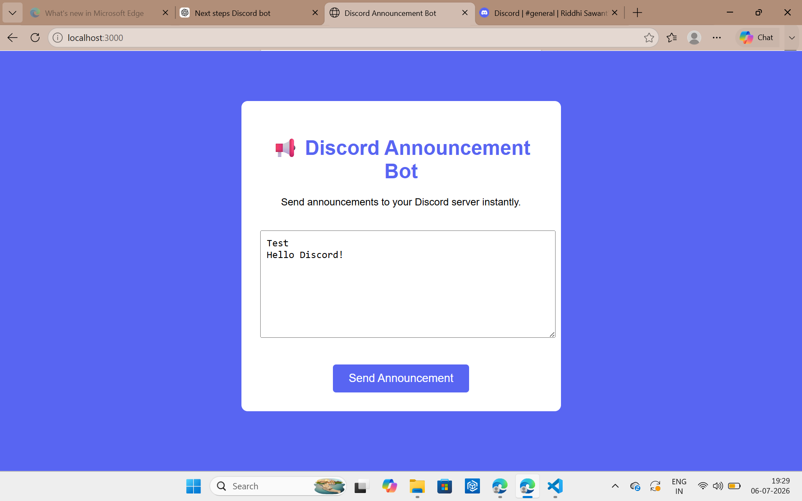
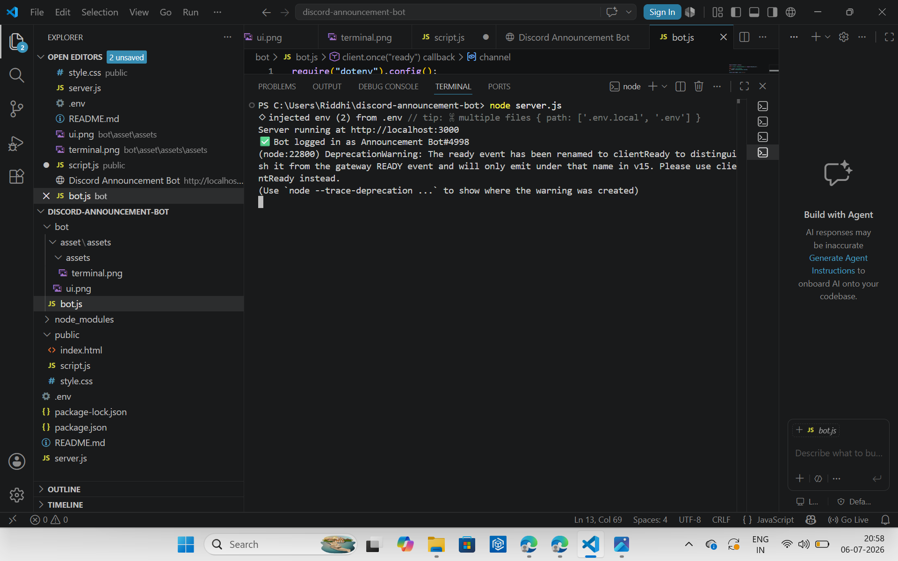
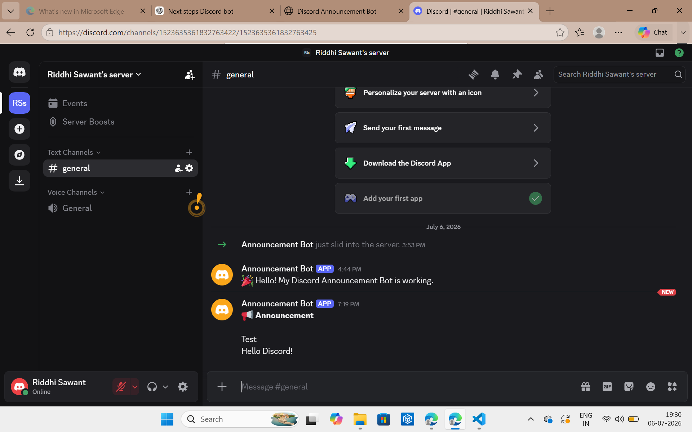

# Discord Announcement Bot

## 📌 Project Name
Discord Announcement Bot

## 👨‍💻 Developed By
Riddhi Rahul Sawant

---

## 🚀 Project Overview
This project is a Discord Announcement Bot integrated with a web interface. It allows users to send announcements from a simple webpage, which are then automatically delivered to a Discord channel using a bot.

---

## ⚙️ Features
- Web-based announcement interface
- Real-time Discord message posting
- Backend API using Express.js
- Discord bot integration
- Easy-to-use UI
- Secure environment variable handling

---

## 🛠️ Tech Stack
- Node.js
- Express.js
- Discord.js
- HTML, CSS, JavaScript
- dotenv

---

## 🔄 How It Works
1. User enters title and message on website
2. Frontend sends POST request to server
3. Server processes request
4. Discord bot sends message to channel

---

## 📷 Project Output

### 🖥️ Frontend UI


### 💻 Terminal Logs


### 💬 Discord Message Output


---

## ▶️ How to Run
```bash
npm install
node server.js
